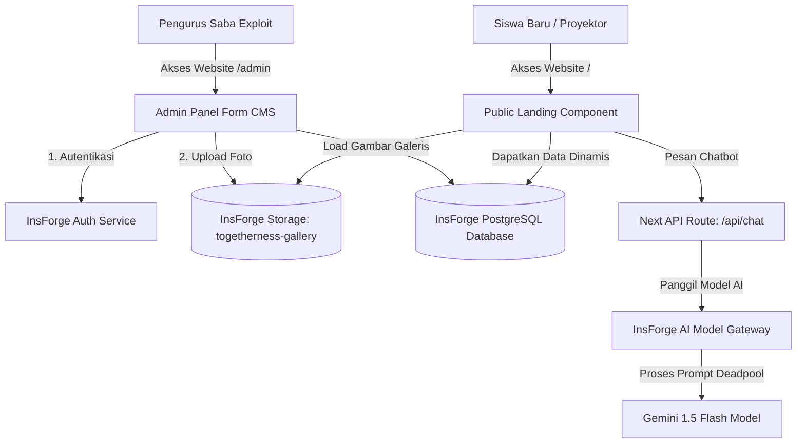
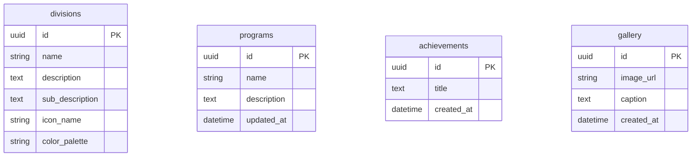
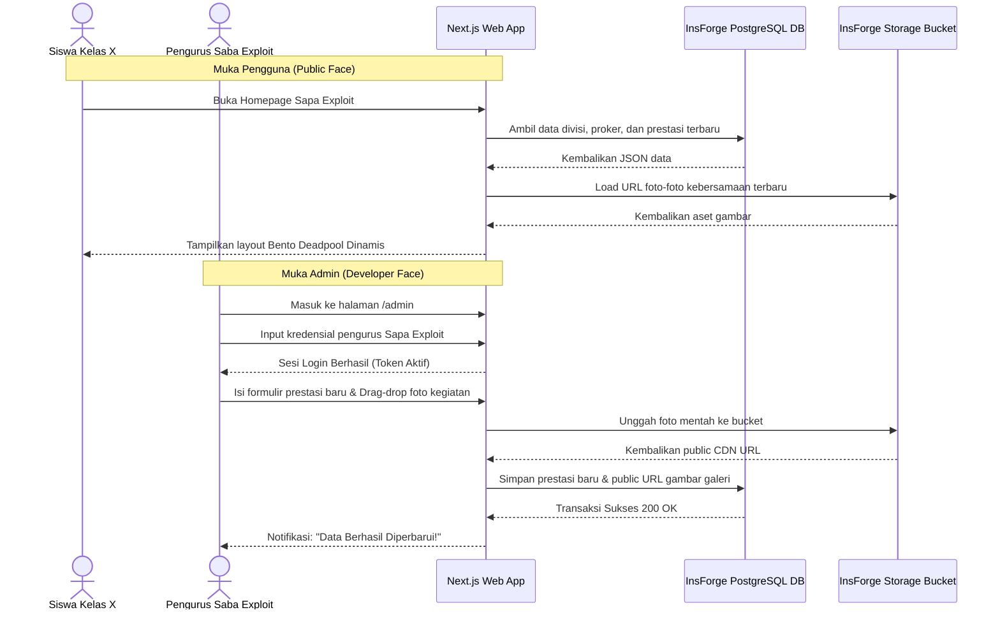

# Product Requirements Document (PRD)
## Project Name: Sapa Exploit Dynamic Profile & OPREC Admin
## Author: Sapa Exploit Development & Creative Team
## Status: Dynamic Two-Face Version (InsForge Integrated)

---

### 1. Executive Summary & Dynamic Vision
SabaExploIT (Sapa Exploit / SE) adalah Unit Kegiatan Kesiswaan (UKK) resmi di SMA Negeri 1 Bantul yang berorientasi pada penguasaan teknologi informasi, pemrograman komputer, dan seni kreatif audio-visual [cite: 1, 2]. Untuk mengesankan murid baru kelas X dalam kegiatan *Open Recruitment* (OPREC), produk ini dirancang sebagai website interaktif satu halaman [cite: 1].

Berbeda dengan prototipe statis sebelumnya, website versi terbaru ini mengimplementasikan **sistem dua muka (Two-Face Architecture)** menggunakan **InsForge Backend Platform** [cite: 3, 4]:
1.  **Public Face (Muka Pengguna):** Halaman depan interaktif bertema "Deadpool" (Merah, Hitam, Putih) dengan Bento Grid dan elemen dramatis yang mengambil data proker, prestasi, dan galeri secara *real-time* dari database [cite: 5, 6, 7].
2.  **Admin Face (Muka Developer/Admin):** Halaman manajemen khusus (`/admin`) yang dilindungi sistem login [cite: 3]. Di sini, pengurus organisasi (developer/admin) dapat menambahkan, memperbarui, atau menghapus data prestasi, program kerja, dan mengunggah foto kegiatan baru tanpa perlu memodifikasi kode HTML/CSS [cite: 3, 8].

---

### 2. User Persona & Two-Face Capabilities

#### 2.1 Public Face ( fresh-minded Freshmen )
*   **Target:** Siswa baru kelas X yang ingin mengeksplorasi Sapa Exploit.
*   **Pengalaman Pengguna (UX):** Menikmati layout Bento Grid yang responsif, membaca deskripsi 5 divisi, membuka modal program kerja kelompok, melihat barisan prestasi bergerak cepat, berinteraksi dengan AI SabaBot, dan menemukan mode terminal rahasia [cite: 5, 6, 7].

#### 2.2 Admin/Developer Face (Sapa Exploit Administrators)
*   **Target:** Pengurus inti Saba Exploit (Admin).
*   **Pengalaman Pengguna (UX):** Melakukan login aman menggunakan email pengurus via InsForge Auth [cite: 3]. Di dalam dasbor admin, mereka disajikan formulir visual sederhana untuk memasukkan pencapaian baru ke dalam Hall of Fame dan fitur drag-and-drop untuk mengunggah foto dokumentasi langsung ke InsForge Storage [cite: 3, 8].

---

### 3. Core Dynamic Features (MVP Specs)

#### F01: Dynamic Hero Section
*   Membaca pesan sambutan teatrikal Deadpool langsung dari tabel database (bisa diganti sewaktu-waktu oleh admin lewat dasbor).

#### F02: Visi & Misi Bento Card
*   Layout Bento asimetris yang menampilkan deskripsi tentang Saba Exploit dan visi misinya secara dinamis.

#### F03: Interactive 5-Divisions Hover Showcase
*   Menampilkan data kelima divisi (Photography, Design, Programming, Technopreneurship, Cinematography) langsung dari database, lengkap dengan ikon, deskripsi detail, serta warna palet visual karya seni masing-masing [cite: 5].

#### F04: Dynamic Proker Explorer (Modal Grid)
*   Grid berisi 10 program kerja (SEtrip, MUBES, SEtor, XIT Store, FPSE, XStory, VPSE, Artopia, Open Recruitment, Ramber) [cite: 5]. Klik pada kartu akan membaca data deskripsi dinamis (*lorem ipsum dolores bla bla bla*) dari database PostgreSQL milik InsForge dan menampilkannya di dalam pop-up modal interaktif [cite: 3, 8].

#### F05: Dynamic Hall of Fame (Prestasi Marquee)
*   Teks berjalan horizontal tanpa batasan (*infinite text marquee*) yang membaca seluruh daftar prestasi secara real-time dari database. Admin tinggal memasukkan prestasi baru di admin panel, dan teks berjalan akan otomatis diperbarui.

#### F06: Dynamic Masonry Gallery with Lightbox
*   Menyajikan foto kebersamaan panitia Sapa Exploit dalam grid asimetris. Gambar dimuat dari alamat URL publik yang dihasilkan oleh InsForge Storage Bucket [cite: 3, 8]. Klik pada foto akan membuka mode Lightbox layar penuh.

#### F07: SabaBot Chatbot Widget
*   Asisten chatbot melayang yang terintegrasi dengan Google Gemini API melalui Model Gateway bawaan milik InsForge [cite: 3].

#### F08: Admin CMS Dashboard (The Secure Face)
*   Halaman login pada `/admin` yang memverifikasi kredensial pengguna [cite: 3].
*   Formulir CRUD (*Create, Read, Update, Delete*) untuk menambah prestasi, memodifikasi detail proker, dan mengunggah foto kebersamaan baru ke media storage [cite: 3, 8].

---

## FILE 2: SRS.md (Software Requirements Specification)

# Software Requirements Specification (SRS)
## Project Name: Sapa Exploit Dynamic Profile Website
## Backend Infrastructure: InsForge (PostgreSQL, Storage, Auth, Model Gateway)

---

### 1. Functional Requirements

#### 1.1 Public Landing Page (Muka Pengguna)
*   **REQ-001:** Halaman utama harus memanggil fungsi `fetch` dari API internal Next.js untuk menarik data secara dinamis dari database InsForge PostgreSQL [cite: 3, 8].
*   **REQ-002:** Perubahan data yang dilakukan di muka Admin harus langsung tercermin pada halaman utama saat dimuat ulang (*SSR/ISR Revalidation*).

#### 1.2 Admin Panel CMS (Muka Admin/Developer)
*   **REQ-003:** Rute `/admin` dan seluruh sub-direktorinya wajib diproteksi menggunakan sesi autentikasi pengguna (*Middleware protection*) berbasis sistem InsForge Auth [cite: 3, 8].
*   **REQ-004:** Halaman admin wajib memiliki form input berikut:
    *   **Form Tambah Prestasi:** Input teks judul pencapaian.
    *   **Form Kelola Proker:** Dropdown pilihan 10 proker, form teks deskripsi proker.
    *   **Form Upload Galeri:** Input file gambar dengan kompresi ukuran di sisi klien (*client-side image compression*) sebelum dikirim ke InsForge Storage bucket [cite: 3, 8].
*   **REQ-005:** Dasbor Admin harus menyediakan daftar tabel ringkas berisi seluruh data yang ada dalam database dengan tombol hapus (Delete) di setiap barisnya.

#### 1.3 Media Storage
*   **REQ-006:** Semua berkas foto kebersamaan yang diunggah wajib dialokasikan ke dalam bucket penyimpanan `togetherness-gallery` di dalam cloud storage InsForge [cite: 3, 8].
*   **REQ-007:** Sistem wajib mencatat URL publik dari aset gambar tersebut ke dalam tabel database `gallery` agar dapat langsung dipanggil di halaman depan [cite: 3, 8].

#### 1.4 AI Integration (SabaBot Agent)
*   **REQ-008:** Input teks dari widget chat dikirim ke endpoint backend `/api/chat`.
*   **REQ-009:** Backend memproses pesan dengan memanggil LLM (Gemini 1.5 Flash) menggunakan integrasi router Model Gateway milik InsForge untuk mengamankan kredensial dan mempercepat inferensi AI [cite: 3].

---

### 2. Non-Functional Requirements
*   **REQ-010:** Batas maksimal ukuran unggahan foto galeri dibatasi sebesar 5MB untuk menghemat ruang kuota InsForge Storage [cite: 3].
*   **REQ-011:** Sesi autentikasi admin menggunakan enkripsi JWT token aman dari InsForge Auth, dengan durasi kedaluwarsa sesi selama 24 jam setelah login sukses [cite: 3].

---

## FILE 3: Architecture.md & SDD.md (System Design Document)

# System Design & Architecture Document (SDD)
## Platform Core: Next.js + InsForge SDK

---

### 1. Unified Architecture Diagram

Website profil Sapa Exploit menggunakan arsitektur dynamic server-side rendering dengan backend mandiri dari platform cloud InsForge [cite: 3].



---

### 2. Database Schema (PostgreSQL di dalam InsForge)

Berikut adalah struktur tabel relasional yang wajib dibuat oleh AI Agent di database PostgreSQL InsForge [cite: 3, 8]:



#### 2.1 Spesifikasi Struktur Tabel Database

##### Tabel: `divisions`
| Kolom | Tipe Data | Atribut | Deskripsi |
| :--- | :--- | :--- | :--- |
| `id` | UUID | PRIMARY KEY, Default: gen_random_uuid() | ID unik divisi |
| `name` | VARCHAR(100) | NOT NULL | Nama divisi (Photography, dll) |
| `description` | TEXT | NOT NULL | Deskripsi singkat divisi |
| `sub_description` | TEXT | NOT NULL | Deskripsi lengkap penjelas |
| `icon_name` | VARCHAR(50) | NOT NULL | Nama ikon lucide-react |
| `color_palette` | VARCHAR(255) | NOT NULL | Daftar warna hex dipisahkan koma |

##### Tabel: `programs`
| Kolom | Tipe Data | Atribut | Deskripsi |
| :--- | :--- | :--- | :--- |
| `id` | UUID | PRIMARY KEY, Default: gen_random_uuid() | ID unik program kerja |
| `name` | VARCHAR(100) | NOT NULL, UNIQUE | Nama proker (Artopia, SEtrip, dsb) |
| `description` | TEXT | NOT NULL | Deskripsi program (*lorem ipsum dolores*) |
| `updated_at` | TIMESTAMP | DEFAULT CURRENT_TIMESTAMP | Tanggal pembaruan data |

##### Tabel: `achievements`
| Kolom | Tipe Data | Atribut | Deskripsi |
| :--- | :--- | :--- | :--- |
| `id` | UUID | PRIMARY KEY, Default: gen_random_uuid() | ID unik prestasi |
| `title` | TEXT | NOT NULL | Teks deskripsi prestasi |
| `created_at` | TIMESTAMP | DEFAULT CURRENT_TIMESTAMP | Tanggal diinput |

##### Tabel: `gallery`
| Kolom | Tipe Data | Atribut | Deskripsi |
| :--- | :--- | :--- | :--- |
| `id` | UUID | PRIMARY KEY, Default: gen_random_uuid() | ID unik foto |
| `image_url` | TEXT | NOT NULL | Link URL publik dari InsForge Storage |
| `caption` | TEXT | NULL | Teks takarir pendukung |
| `created_at` | TIMESTAMP | DEFAULT CURRENT_TIMESTAMP | Tanggal foto diunggah |

---

## FILE 4: UI_UX_Flow.md & user_flow.md

# UI/UX Dynamic Navigation & Two-Face Flows

---

### 1. Admin CMS Panel Navigation Flow
[ Admin Mengakses /admin ]
  ├── JIKA Belum Login ──> Tampilkan Formulir Login (Email & Password) [cite: 3]
  │                           └── Input Valid ──> Masuk Sesi & Alihkan ke Dashboard Admin [cite: 3]
  └── JIKA Sudah Login ──> Tampilkan Dasbor Utama
                              ├── Tab 1: Hall of Fame (Kelola daftar prestasi secara real-time)
                              ├── Tab 2: Program Kerja (Edit deskripsi teks *lorem ipsum*)
                              ├── Tab 3: Galeri Foto (Unggah foto kegiatan baru via File Picker)
                              └── Tombol: Logout (Keluar sesi & kembali ke homepage)

---

### 2. User Flow Diagram (Two-Face Interaction)



---

## FILE 5: API_Documentation.md

# API Documentation: Dynamic Endpoints & InsForge Client Queries

---

### 1. Client SDK Database Initialization (`src/lib/insforge.ts`)

Aplikasi menggunakan pustaka resmi `@insforge/sdk` untuk melakukan interaksi database dari sisi klien (muka pengguna) dan server (muka admin) [cite: 9]:

```typescript
import { createClient } from '@insforge/sdk';

const insforgeUrl = process.env.NEXT_PUBLIC_INSFORGE_URL |

| '';
const insforgeAnonKey = process.env.NEXT_PUBLIC_INSFORGE_ANON_KEY |

| '';

// Digunakan untuk penarikan data publik di halaman depan (Public Face)
export const insforge = createClient(insforgeUrl, insforgeAnonKey);
```

---

### 2. API Endpoint: Chatbot Handler (`app/api/chat/route.ts`)
Endpoint internal Next.js untuk memproses chat dari widget SabaBot:
*   **Method:** `POST`
*   **Request Payload (JSON):**
    ```json
    {
      "message": "Kak, ada tes masuknya gak buat divisi cinematography?"
    }
    ```
*   **Back-End Controller Logic (Node.js/Next.js):**
    ```typescript
    import { NextResponse } from 'next/server';
    import { GoogleGenAI } from '@google/generative-ai';
    import { insforge } from '@/lib/insforge';

    export async function POST(req: Request) {
      try {
        const { message } = await req.json();
        
        // Menggunakan InsForge Model Gateway untuk mendapatkan API Key Gemini secara aman di sisi server
        const ai = new GoogleGenAI({ apiKey: process.env.INSFORGE_AI_GATEWAY_KEY });
        const model = ai.getGenerativeModel({ model: 'gemini-1.5-flash' });
        
        const systemPrompt = `Kamu adalah SabaBot, asisten virtual resmi pendaftaran Sapa Exploit SMAN 1 Bantul. Kepribadianmu adalah gabungan orang IT jenius, senior ramah, dan Deadpool (sarkas, lucu, enerjik, gaul, sering memecahkan dinding keempat). Jawab dengan ramah menggunakan bahasa anak muda. Katakan bahwa pemula SANGAT BOLEH bergabung di seluruh divisi.`;

        const result = await model.generateContent([systemPrompt, message]);
        const responseText = result.response.text();

        return NextResponse.json({ reply: responseText });
      } catch (error) {
        return NextResponse.json({ error: 'Chatbot processing failed.' }, { status: 500 });
      }
    }
    ```

---

### 3. Database Action: Upload New Photo (`app/api/admin/upload/route.ts`)
Endpoint internal yang digunakan oleh Muka Admin untuk mengunggah berkas foto kegiatan baru:
*   **Method:** `POST`
*   **Request Payload (Multipart Form Data):**
    *   `file`: Berkas gambar (.png, .jpg)
    *   `caption`: Teks takarir pendukung
*   **Proses Penyimpanan:**
    1.  Menerima berkas gambar dari formulir admin.
    2.  Mengirimkan berkas ke InsForge Storage bucket menggunakan fungsi `insforge.storage.from('togetherness-gallery').upload()`.
    3.  Mendapatkan tautan publik dari InsForge CDN.
    4.  Membuat entri baris baru pada tabel PostgreSQL `gallery` berisi tautan URL tersebut beserta takarirnya.

---

## FILE 6: DESIGN.md

# DESIGN.md - Dynamic UI/UX System Specification
## Theme Identity: Tactical Deadpool Bento
## Visual Layer: Awesome-Design-MD Standards

---

### 1. Palette Specification (Dynamic Application)
Latar belakang menggunakan kontras dramatis gelap pekat untuk membuat komponen grid bento dan visual glowing dari neon merah memukau mata audiens [cite: 6, 7].

```css
--canvas-black: #060608;    /* Latar belakang dasar website */
--card-dark: #121216;      /* Warna dasar kotak bento */
--deadpool-red: #E23636;   /* Merah Crimson menyala untuk highlight, tombol, dan border aktif */
--deadpool-white: #F3F3F5; /* Teks utama kontras tinggi */
--slate-border: #212126;   /* Warna border default komponen */
```

---

### 2. Grid & Panel Geometry
*   **Bento Card Border:** Setiap kartu Bento memiliki border tegas `1px solid var(--slate-border)` dengan sudut sedikit tumpul `rounded-xl` (12px) [cite: 10].
*   **Interactive Comic Shadow:** Setiap elemen tombol primer atau bento yang dalam keadaan aktif/di-hover akan memunculkan bayangan padat (tanpa efek blur) berwarna merah Deadpool di bagian kanan-bawah komponen:
    ```css
    box-shadow: 6px 6px 0px 0px #E23636;
    ```
*   **Typography:** Heading raksasa menggunakan font sans-serif geometris **Outfit** (Black 900) untuk memberikan kesan judul komik/film aksi yang berani [cite: 6]. Paragraf teks penjelasan menggunakan **Inter** (Regular 400) [cite: 7].

---

## FILE 7: Actionable_Task_Breakdown.md

# Actionable Task Breakdown for AI Coding Agent
## Execution Flow: Scaffold & Assemble Next.js + InsForge

---

### TASK 1: Base Application Scaffold & Environment Setup
1. Buat folder proyek Next.js baru yang terintegrasi dengan Tailwind CSS dan TypeScript:
   ```bash
   npx create-next-app@latest sapa-exploit-dynamic --ts --tailwind --eslint --app --src-dir --import-alias "@/*"
   ```
2. Instal paket dependensi pendukung:
   ```bash
   npm install framer-motion lucide-react @insforge/sdk @google/generative-ai
   ```
3. Buat berkas `.env.local` di root proyek dan isikan variabel lingkungan dari InsForge:
   ```env
   NEXT_PUBLIC_INSFORGE_URL=https://<your-project-id>.insforge.app
   NEXT_PUBLIC_INSFORGE_ANON_KEY=<your-project-anon-key>
   INSFORGE_AI_GATEWAY_KEY=<your-insforge-ai-gateway-api-key>
   ```

---

### TASK 2: Database Schema Scaffolding via InsForge
1. Jalankan CLI InsForge untuk menghubungkan direktori lokal dengan konsol awan [cite: 3, 11]:
   ```bash
   npx @insforge/cli login
   npx @insforge/cli link
   ```
2. Minta AI Agent untuk mengeksekusi SQL skema database berikut ke editor SQL InsForge untuk membuat tabel-tabel utama [cite: 3, 11]:
   ```sql
   CREATE TABLE divisions (
     id UUID PRIMARY KEY DEFAULT gen_random_uuid(),
     name VARCHAR(100) NOT NULL,
     description TEXT NOT NULL,
     sub_description TEXT NOT NULL,
     icon_name VARCHAR(50) NOT NULL,
     color_palette VARCHAR(255) NOT NULL
   );

   CREATE TABLE programs (
     id UUID PRIMARY KEY DEFAULT gen_random_uuid(),
     name VARCHAR(100) NOT NULL UNIQUE,
     description TEXT NOT NULL,
     updated_at TIMESTAMP DEFAULT CURRENT_TIMESTAMP
   );

   CREATE TABLE achievements (
     id UUID PRIMARY KEY DEFAULT gen_random_uuid(),
     title TEXT NOT NULL,
     created_at TIMESTAMP DEFAULT CURRENT_TIMESTAMP
   );

   CREATE TABLE gallery (
     id UUID PRIMARY KEY DEFAULT gen_random_uuid(),
     image_url TEXT NOT NULL,
     caption TEXT,
     created_at TIMESTAMP DEFAULT CURRENT_TIMESTAMP
   );
   ```

---

### TASK 3: Database Seeder Script Execution
1. Buat skrip seeder sementara atau jalankan perintah SQL berikut untuk mengisi data dasar profil organisasi Saba Exploit dari PDF agar database tidak kosong di awal [cite: 5, 11]:
   ```sql
   INSERT INTO divisions (name, description, sub_description, icon_name, color_palette) VALUES
   ('Photography', 'Divisi fotografi berisi anggota yang ahli di bidang fotografi.', 'Lorem ipsum dolor sit amet, consectetur adipiscing elit.', 'Camera', '#E23636,#1C1C1E,#FAFAFA'),
   ('Design', 'Divisi design berorientasi pada seni desain grafis.', 'Lorem ipsum dolor sit amet, consectetur adipiscing elit.', 'Palette', '#8B5CF6,#1C1C1E,#FAFAFA'),
   ('Programming', 'Divisi pemrograman siber, pengembangan website, dan pemecahan algoritma.', 'Lorem ipsum dolor sit amet, consectetur adipiscing elit.', 'Code2', '#10B981,#1C1C1E,#FAFAFA'),
   ('Technopreneurship', 'Pengembangan usaha berbasis teknologi modern.', 'Lorem ipsum dolor sit amet, consectetur adipiscing elit.', 'TrendingUp', '#F59E0B,#1C1C1E,#FAFAFA'),
   ('Cinematography', 'Divisi pembuatan film pendek berkualitas peraih juara.', 'Lorem ipsum dolor sit amet, consectetur adipiscing elit.', 'Film', '#EC4899,#1C1C1E,#FAFAFA');

   INSERT INTO programs (name, description) VALUES
   ('SEtrip', 'Lorem ipsum dolores bla bla bla. Kegiatan petualangan dan bonding akrab pengurus Sapa Exploit.'),
   ('SEtor', 'Lorem ipsum dolores bla bla bla. Program penyetoran karya kreatif bulanan.'),
   ('FPSE', 'Lorem ipsum dolores bla bla bla. Pameran karya internal untuk anggota muda.'),
   ('VPSE', 'Lorem ipsum... Screening film pendek karya Cinematography.'),
   ('Open Recruitment', 'Sistem penerimaan anggota baru kelas X.'),
   ('MUBES', 'Musyawarah Besar LPJ dan regenerasi ketua umum.'),
   ('XIT Store', 'Lini technopreneurship penjualan merchandise.'),
   ('XStory', 'Dokumentasi cerita kegiatan organisasi di media sosial.'),
   ('Artopia', 'Pameran kolaboratif seni visual digital Sapa Exploit.'),
   ('Ramber', 'Malam ramah tamah bersama alumni Sapa Exploit.');

   INSERT INTO achievements (title) VALUES
   ('Juara III dan V FLSSN Fotografi 2024 tingkat Nasional'),
   ('Juara III FLSSN Cipta Lagu tingkat Provinsi 2023'),
   ('Juara I FLSSN Desain Poster tingkat Kabupaten 2024'),
   ('Juara V OSN Informatika tingkat Kabupaten 2024'),
   ('Juara II FLSSN Film Pendek 2023');
   ```

---

### TASK 4: Developing Client-Side UI & Components
1.  **Navbar (`src/components/Navbar.tsx`):**
    *   Menerapkan navigasi dinamis dengan smooth anchor scrolling.
2.  **Hero Component (`src/components/Hero.tsx`):**
    *   Visual tebal dominan Merah-Hitam dengan topeng komik Deadpool dan tagline interaktif.
3.  **About & Visi Misi Bento Grid (`src/components/About.tsx`):**
    *   Tarik deskripsi sejarah dari tabel database `programs` / data umum secara dinamis [cite: 3].
4.  **Divisions Component (`src/components/Divisions.tsx`):**
    *   Ambil data dinamis dari tabel `divisions`. Buat efek kartu meregang saat kursor diarahkan (*hover state*).
5.  **Proker Grid & Modal Portal (`src/components/ProkerGrid.tsx` & `/src/components/ProkerModal.tsx`):**
    *   Ambil data dinamis dari tabel `programs`. Tampilkan modal pop-up detail proker yang ditarik dari database saat diklik [cite: 3].
6.  **Prestasi Marquee (`src/components/HallOfFame.tsx`):**
    *   Lakukan *query select* ke tabel `achievements`. Tampilkan dalam barisan marquee bergerak horizontal [cite: 3].
7.  **SabaBot Virtual Assistant (`src/components/SabaBotWidget.tsx`):**
    *   Tampilkan floating widget chat yang terhubung ke endpoint `/api/chat`.

---

### TASK 5: Developing Secure Admin Interface (CMS Face)
1.  **Admin Auth Check Middleware (`src/middleware.ts`):**
    *   Gunakan SDK `insforge.auth` untuk memproteksi agar rute `/admin` tidak bisa dibuka kecuali pengguna sudah login [cite: 3, 9].
2.  **Login Page (`src/app/admin/login/page.tsx`):**
    *   Sajikan form input email dan kata sandi yang memicu fungsi `insforge.auth.signInWithPassword()` [cite: 3, 9].
3.  **Dasbor CMS (`src/app/admin/dashboard/page.tsx`):**
    *   Buat antarmuka layout admin panel yang bersih dengan 3 tab:
        *   **Tab Prestasi:** Form tambah baris prestasi baru ke tabel `achievements`, dan daftar tabel prestasi aktif dengan tombol hapus (Delete) [cite: 3].
        *   **Tab Edit Proker:** Form pemilihan proker, textarea untuk mengedit penjelasan deskripsi, dan tombol simpan [cite: 3].
        *   **Tab Unggah Foto Galeri:** Komponen upload file drag-and-drop. Ketika berkas gambar dipilih, upload ke storage bucket menggunakan `insforge.storage.from('togetherness-gallery').upload()` lalu simpan URL yang dihasilkan beserta takarir ke tabel database `gallery` [cite: 3, 9].

---

### TASK 6: Terminal Easter Egg Implementation
1. Buat berkas `/src/components/TerminalMode.tsx`.
2. Di halaman utama `/src/app/page.tsx`, tangkap masukan ketukan keyboard secara global. Jika terdeteksi input string runtut bertuliskan "SABA", ganti tampilan grafis default dengan memicu render komponen terminal retro CLI hitam-hijau neon.
3. Berikan fungsionalitas CLI dasar: perintah `help`, `about`, dan `exit` (`Esc` juga menutup terminal). Listener global WAJIB mengabaikan event dari `<input>`/`<textarea>`/contentEditable agar tidak salah-picu saat user mengetik di SabaBot atau form admin.

---

## IMPLEMENTATION ADDENDUM (as-built, Phase 0–7)

This PRD is the original spec; the points below record where the shipped code intentionally differs or extends it. **Code is the source of truth.**

### Backend / SDK corrections
- **AI:** the chatbot does **not** use `@google/generative-ai`/`GoogleGenAI` (that snippet in FILE 5 is wrong and was not used). It uses the **OpenAI SDK pointed at InsForge's OpenRouter gateway**, server-side only, model `google/gemini-2.5-flash`. Env var: `OPENROUTER_API_KEY` (secret, no `NEXT_PUBLIC_`).
- **Auth route protection:** Next.js 16 renamed Middleware → **Proxy**, so protection lives in `src/proxy.ts` (not `middleware.ts`), using `updateSession` from `@insforge/sdk/ssr/middleware`.
- **No `/api/upload` route:** gallery uploads run through a **Server Action** in `admin/(protected)/gallery/actions.ts` (`storage.from('togetherness-gallery').upload(...)`), which returns `{ url, key }` directly. Both are persisted to the `gallery` table so deletes also remove the Storage object.
- **Env var names (as-built):** `NEXT_PUBLIC_INSFORGE_URL`, `NEXT_PUBLIC_INSFORGE_ANON_KEY`, `INSFORGE_API_KEY` (secret admin), `OPENROUTER_API_KEY` (secret).

### Database
- Added a **`site_content`** table (key/value site copy) beyond the four in the ER diagram, powering the editable Hero/About text (F01/F02).

### Admin CMS scope (F10) — five sections, not three
Beyond Achievements / Programs / Gallery, the shipped dashboard also includes:
- **Divisions editor** (`/admin/divisions`) — edit the 5 divisions' description, sub-description, icon, palette.
- **Site Content editor** (`/admin/content`) — edit Hero/About and other `site_content` copy, no-code.
Protected pages live under the `admin/(protected)/` route group whose `layout.tsx` redirects unauthenticated users to `/admin/login` (login page sits OUTSIDE the group to avoid a redirect loop).

### Terminal Easter Egg (F08) — final commands
Commands are `help`, `about`, `exit` (the earlier `divisi` idea was dropped). Full-screen `#00FF00`-on-black JetBrains Mono overlay at `z-[100]`; trigger ignores form fields; cleans up on unmount.

### Phase 7 polish
Pro metadata + Open Graph/Twitter cards in `layout.tsx`, mobile-responsiveness pass on the Bento grid and terminal, and a Vercel/Netlify deployment guide (see project handoff).

---